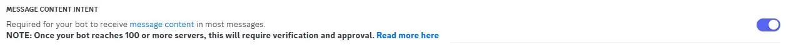
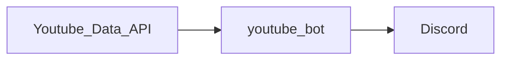

# [youtube_bot](https://github.com/n138-kz/youtube_bot)

## Activity

[](/LICENSE)
[](/../../)
[](/../../)
[](/../../)
[](/../../commits)
[](/../../commits)
[](/../../commits)
[](/../../issues)
[](/../../issues)
[](/../../pulls)
[](/../../pulls)
[](/../../)
[](/../../)

## Github RestAPI

```http
GET https://api.github.com/repos/n138-kz/youtube_bot
```

<details>

  [n138-kz/youtube_bot](https://api.github.com/repos/n138-kz/youtube_bot) (Public repos only)
  
</details>

## Refs

- [Developer Console](https://console.cloud.google.com/apis/credentials?hl=ja&project=upbeat-splicer-325708)
- [Google公式リファレンス](https://developers.google.com/identity/gsi/web/guides/migration?hl=ja)
- [YouTube Data API v3](https://console.cloud.google.com/apis/api/youtube.googleapis.com/quotas?inv=1&invt=AbqMUg&project=bold-rampart-413416)
- [Developer Console](https://discord.com/developers/applications)
- [Discord公式リファレンス](https://discord.com/developers/docs/topics/oauth2)
- [「DiscordのIDでログイン」を実装する(Oauth2)](https://qiita.com/masayoshi4649/items/46fdb744cb8255f5eb98)
- [PHP、CURLFileでファイルをアップロードする。(multipart/form-data、POST)](https://qiita.com/Pell/items/4ed98c906fd6a580a33f)
- [OAuth2 Scopesの一覧](https://scrapbox.io/discordwiki/OAuth2_Scopes%E3%81%AE%E4%B8%80%E8%A6%A7)
- [http_post](https://github.com/n138-kz/http_post)
- [discord.pyを使用したdiscord botの作り方](https://qiita.com/TakeMimi/items/1e2d76eecc25e92c93ef#210-ver)
- [Ping値を測定](https://discordbot.jp/blog/16/)
- [Discord.py の Intents について](https://qiita.com/Erytheia/items/8b8e14f60fd7f266872b)
- [discord.py入門(1)](https://qiita.com/sizumita/items/9d44ae7d1ce007391699)
- [YouTube APIを用いてPythonでデータを取得する](https://zenn.dev/eito_blog/articles/94dc874c112c9f)
- [【Python】YouTube Data API を使って、いろんな情報を取得してみた](https://qiita.com/rkamikawa/items/dd1fd4c1427ece787eea)
- [DiscordのBotでのファイル添付の仕方など【Python】](https://qiita.com/chatrate/items/aa6625f6663fa2ca33d6)
- [)send_Discord](https://github.com/n138-kz/send_Discord)
- [Discordにwebhook経由でPOST(cURL)](https://qiita.com/n138-kz/items/7b86e3eee9d9994fc4d2)
- [【discord.py】複数ファイルを同時に送信するなど。](https://zenn.dev/milkystack/articles/35948cdfb7eb00)

## Issue client_credential (google)

1. access to [Developer Console](https://console.cloud.google.com/apis/credentials?hl=ja&project=upbeat-splicer-325708)
1. Create new project.
1. Forward to 認証情報 (left side pain)
1. Create API Key.
1. Create OAuth client_id(type=Web Application)

## Issue client_credential (discord)

1. access to [Developer Console](https://discord.com/developers/applications)
1. Create new application.
1. Reset OAuth2 information.
1. Reset bot token.
1. Turn on Message Content Intent


## Sample of .secret/config

<details>

```json
{
    "internal":{
        "build":{
            "requirement":[
                "discord",
                "google-api-python-client"
            ]
        },
        "youtube":{
            "notice_limit":3600,
            "cycle_interval":300,
            "channel_id":""
        },
        "discord":{
            "send_message_channel":{
                "on_ready":[
                ],
                "notice":[
                ]
            }
        }
    },
    "external":{
        "youtube":{
            "api_key":"",
            "client_id":"",
            "client_secret":"",
            "web": {
                "client_id": "",
                "project_id": "",
                "auth_uri": "",
                "token_uri": "",
                "auth_provider_x509_cert_url": "",
                "client_secret": ""
            }
        },
        "discord":{
            "client_id":0,
            "client_secret":"",
            "public_key":"",
            "bot_token":"",
            "scope":{
                "redirect_url":null,
                "bot":[
                    "view_channel (1024)",
                    "send_message (2048)",
                    "embed_links (16384)",
                    "attach_files (32768)",
                    "read_message_history (65536)",
                    "mention_everyone (131072)",
                    "use_slash_command (2147483648)",
                    "use_embedded_activities (549755813888)"
                ]
            },
            "install_context":{
                "user":false,
                "guild":true
            },
            "bot_invite_url":""
        }
    }
}
```

|項目名|必須|デフォルト値|説明|
|:-|:-|:-|:-|
|`.internal.build.requirement`|🟢False|||
|`.internal.youtube.notice_limit`|🟠True|||
|`.internal.youtube.cycle_interval`|True|||
|`.internal.youtube.channel_id`|True|||
|`.internal.discord.send_message_channel.on_ready`|True||指定しない場合は`[]`|
|`.internal.discord.send_message_channel.notice`|True||指定しない場合は`[]`|
|`.external.youtube.api_key`|True|||
|`.external.youtube.client_id`|True|||
|`.external.youtube.client_secret`|True|||
|`.external.youtube.web`|False|||
|`.external.discord.client_id`|True|||
|`.external.discord.client_secret`|True|||
|`.external.discord.public_key`|False|||
|`.external.discord.bot_token`|True|||
|`.external.discord.scope.redirect_url`|False|||
|`.external.discord.scope.bot`|False|||
|`.external.discord.install_context.user`|False|||
|`.external.discord.install_context.guild`|False|||
|`.external.discord.bot_invite_url`|False|||

</details>

## Relation



## Library

- python: 3.11.9 (tags/v3.11.9:de54cf5, Apr  2 2024, 10:12:12) [MSC v.1938 64 bit (AMD64)]
- discordpy: 2.5.0 (VersionInfo(major=2, minor=5, micro=0, releaselevel='final', serial=0))

## License

[Copyright (c) 2025 Yuu Komiya (n138), Under MIT License](LICENSE)  

<details>

[MIT_License | wikipedia](https://ja.wikipedia.org/wiki/MIT_License)

[The MIT License](https://opensource.org/license/mit/)
> [n138-kz/*](./) is licensed under the `MIT License`.  
>
> Permission is hereby granted, free of charge, to any person obtaining a copy of this software and associated documentation files (the “Software”), to deal in the Software without restriction, including without limitation the rights to use, copy, modify, merge, publish, distribute, sublicense, and/or sell copies of the Software, and to permit persons to whom the Software is furnished to do so, subject to the following conditions:
>
> `Copyright <YEAR> <COPYRIGHT HOLDER>`
> 
> The above copyright notice and this permission notice shall be included in all copies or substantial portions of the Software.
> 
> THE SOFTWARE IS PROVIDED “AS IS”, WITHOUT WARRANTY OF ANY KIND, EXPRESS OR IMPLIED, INCLUDING BUT NOT LIMITED TO THE WARRANTIES OF MERCHANTABILITY, FITNESS FOR A PARTICULAR PURPOSE AND NONINFRINGEMENT. IN NO EVENT SHALL THE AUTHORS OR COPYRIGHT HOLDERS BE LIABLE FOR ANY CLAIM, DAMAGES OR OTHER LIABILITY, WHETHER IN AN ACTION OF CONTRACT, TORT OR OTHERWISE, ARISING FROM, OUT OF OR IN CONNECTION WITH THE SOFTWARE OR THE USE OR OTHER DEALINGS IN THE SOFTWARE.

[The MIT License](https://opensource.org/license/mit/)
> [n138-kz/*](./) は、MIT ライセンスに基づいてライセンスされています。  
> 以下に定める条件に従い、本ソフトウェアおよび関連文書のファイル（以下「ソフトウェア」）の複製を取得するすべての人に対し、ソフトウェアを無制限に扱うことを無償で許可します。これには、ソフトウェアの複製を使用、複写、変更、結合、掲載、頒布、サブライセンス、および/または販売する権利、およびソフトウェアを提供する相手に同じことを許可する権利も無制限に含まれます。  
>
> `Copyright (c) <著作権発生年> <著作権保持者名>`
> 
> 上記の著作権表示および本許諾表示を、ソフトウェアのすべての複製または重要な部分に記載するものとします。
>
> ソフトウェアは「現状のまま」で、明示であるか暗黙であるかを問わず、何らの保証もなく提供されます。ここでいう保証とは、商品性、特定の目的への適合性、および権利非侵害についての保証も含みますが、それに限定されるものではありません。
> 作者または著作権者は、契約行為、不法行為、またはそれ以外であろうと、ソフトウェアに起因または関連し、あるいはソフトウェアの使用またはその他の扱いによって生じる一切の請求、損害、その他の義務について何らの責任も負わないものとします。

### Permissions / 許可
- Commercial use / 商用利用
- Modification / 改変
- Distribution / 再配布
- Private use / 私的使用 

### Limitations / 制限事項
- Liability / 発生した問題に責任を負わない
- Warranty / 無保証

</details>
